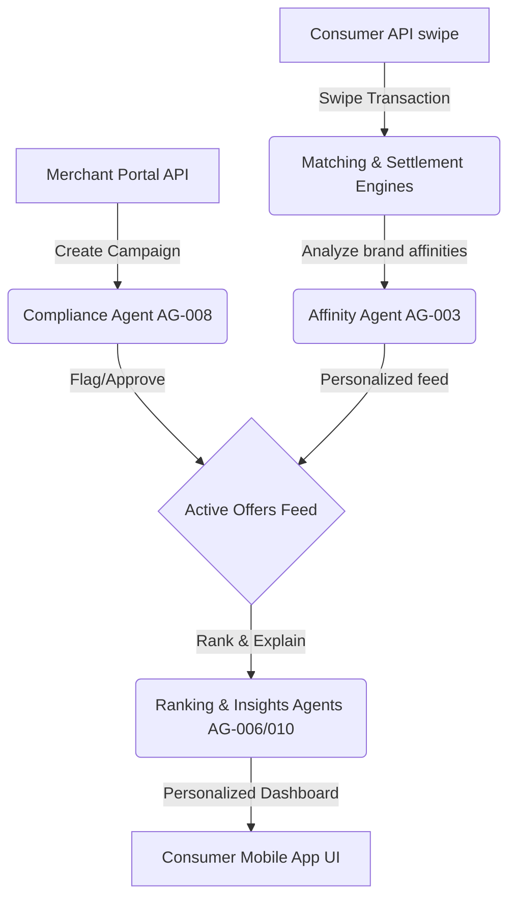

# Synq: Banking-Powered Commerce Intelligence Network

Synq is an agentic, banking-powered commerce network intelligence framework. It simulates card-linked offer workflows, matching consumer transactions directly to personalized merchant campaign cashbacks while utilizing specialized LLM-driven agents for proposal generation, compliance audits, brand affinity analysis, and offer feed ranking.

<p align="center">
  
</p>

---

## System Architecture

Synq simulates an end-to-end regional bank commerce network with:
- **FastAPI Backend Server**: Exposes API portals for compliance managers, merchant portals, and consumer transaction feeds.
- **Card Swipe matching engines**: Matches transactions against activated offers deterministically.
- **Agentic intelligence layer**: Generates, reviews, ranks, and explains offers based on customer brand affinity.
- **Console CLI Tool**: Provides direct CLI testing commands to run/swipe card transactions and manage setups.



---

## Agentic Roles (The Synq Intelligence Layer)

1. **Merchant Campaign Agent (AG-001)**: Interacts with merchants to generate marketing proposals matching their goals (e.g. "acquire weekend breakfast users").
2. **Compliance Audit Agent (AG-008)**: Scans campaign names, categories, and marketing copy for regulatory flags (deceptive terms, restricted categories like alcohol or gambling) and verifies legal disclosures.
3. **Customer Brand Affinity Agent (AG-003)**: Tracks consumer spending frequency and volume across categories (Dining, Coffee, Travel, Retail, Fitness) to calculate brand affinity profiles.
4. **Offer Ranking Agent (AG-006)**: Personalizes active campaign order priorities for each consumer based on their affinity matrix.
5. **Insights Agent (AG-010)**: Writes friendly consumer-facing messages explaining why the user will love the recommended cashbacks.

---

## Installation & CLI Setup

### Prerequisites
- Python >= 3.10
- Recommended virtual environment runner: `conda` or `venv`

### Installation
Clone the repository and install it in editable mode:
```bash
pip install -e .
```

### Run the Web Server and Dashboard
Launch the FastAPI backend server and automatically open the visual portal interface:
```bash
synq web
```
The application will start on `http://127.0.0.1:8000`.

### Run Card Swipe Simulation from CLI
You can simulate a debit/credit card swipe at a merchant to run matching, cashback ledger credits, and bank settlement fees:
```bash
synq simulate --customer-name "Alice Vance" --merchant "Starbucks" --amount 15.50
```

---

## Environment Configuration

Configure your environment keys inside a `.env` file in the project root:

```bash
# LLM Provider Keys
OPENAI_API_KEY=your-openai-key
GOOGLE_API_KEY=your-google-key
ANTHROPIC_API_KEY=your-anthropic-key

# Optional Customizations (overriding default_config.py)
SYNQ_LLM_PROVIDER=openai
SYNQ_DEEP_THINK_LLM=gpt-4o
SYNQ_QUICK_THINK_LLM=gpt-4o-mini
SYNQ_TEMPERATURE=0.0
```

---

## Testing

Run unit and integration tests across the compliance audits, matching engines, and database conversions:
```bash
PYTHONPATH=. uv run pytest
```
